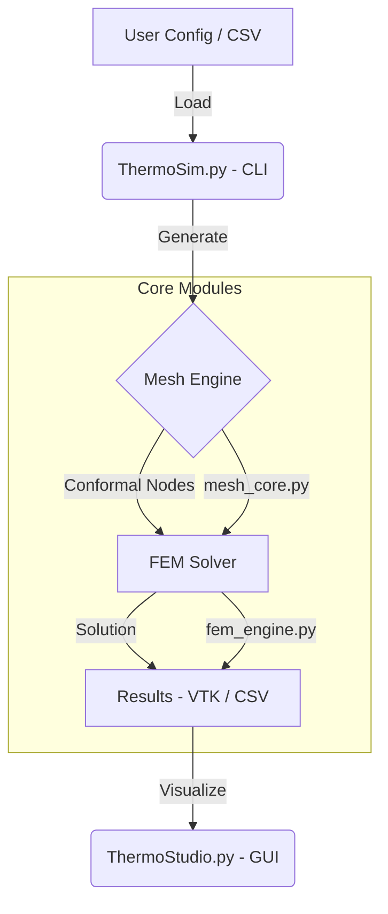

# System Design & Architecture

## 1. Architectural Overview

ThermoSim is a modular, high-precision thermal simulator designed for 3D IC and package analysis. It separates the simulation pipeline into distinct, interchangeable stages: **Preprocessing (Meshing)**, **Solving (FEM)**, and **Post-processing (Visualization)**.

## 2. Core Modules

### A. Mesh Engine (`mesh_core.py`)
-   **Architecture**: "Gap-Filler" Conformal Meshing.
-   **Logic**:
    1.  **Constraint Identification**: Parses all box boundaries and power map regions as hard constraints.
    2.  **Gap Analysis**: Identifies empty regions between constraints.
    3.  **Adaptive Subdivision**: Fills gaps with hex elements, refining only where necessary (e.g., heat sources).
    4.  **Midpoint Injection**: Forces nodes at the center of power sources for peak accuracy.
-   **Output**: A conformal grid ensuring 0% numeric alignment error.

### B. Physics Solver (`fem_engine.py`)
-   **Method**: 3D Finite Element Method (Galerkin).
-   **Equation**: $\nabla \cdot (k \nabla T) + Q = 0$
-   **Matrix format**: Compressed Sparse Row (CSR) for memory efficiency.
-   **Accelerators**:
    -   **CPU**: `scipy.sparse.linalg.cg` (Preconditioned Conjugate Gradient).
    -   **GPU**: `cupy.sparse.linalg` (Auto-detected).

### C. Post-Processor (`post_process.py`)
-   **Dual-Reporting**: Calculates both **Nodal Peak** (for reliability limits) and **Element Average** (for coarse-model correlation).
-   **Filter**: Apply specialized masks to separate component temperatures (e.g., Die vs. Mold).

## 3. Data Flow

1.  **Input Parsing**: `source_manager.py` reads `.config` files and `floorplan.csv`.
2.  **Model Construction**:
    -   Physical properties mapped to materials.
    -   Geometries normalized to SI units.
3.  **Execution**:
    -   System Matrix $[K]$ and Load Vector $\{F\}$ assembled.
    -   Temperature $\{T\}$ solved: $[K]\{T\} = \{F\}$.
4.  **Output**:
    -   Structured Grid (`.vtk`) for Paraview/ThermoStudio.
    -   Summary Report (`.txt`) for quick analysis.

## 4. Visualization (`ThermoStudio.py`)
-   Built on **PyVista** (VTK backend).
-   Provides interactive 3D slicing, thresholding, and scalar warping.
-   Directly reads the `.vtk` output from the solver.
